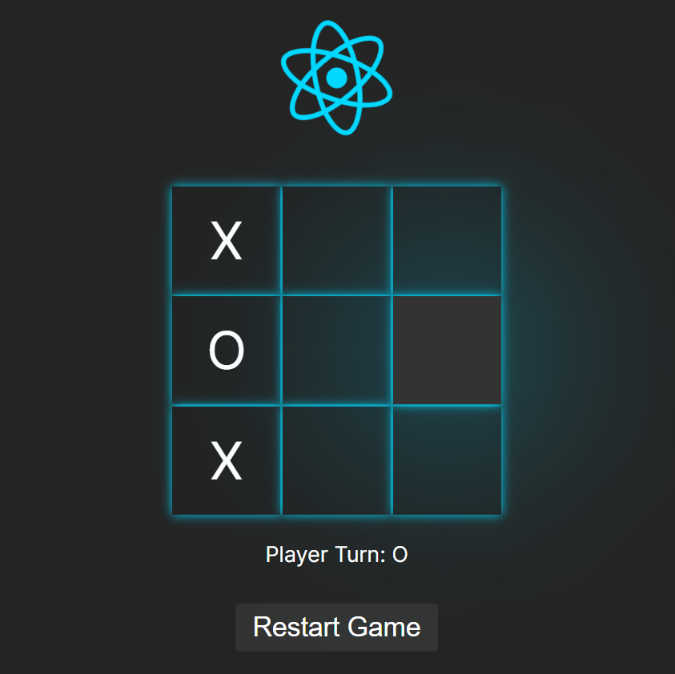
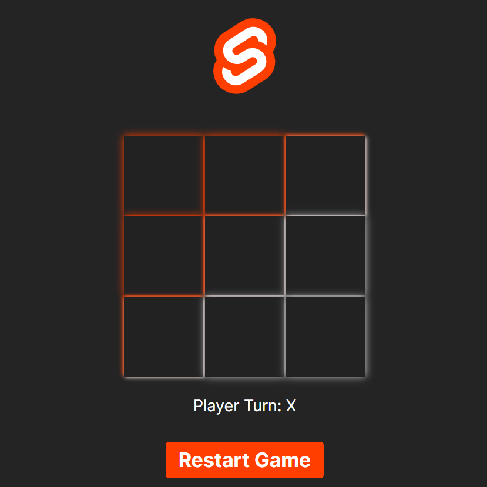
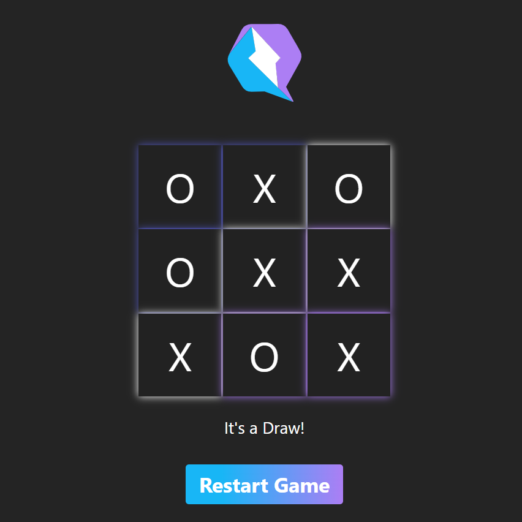
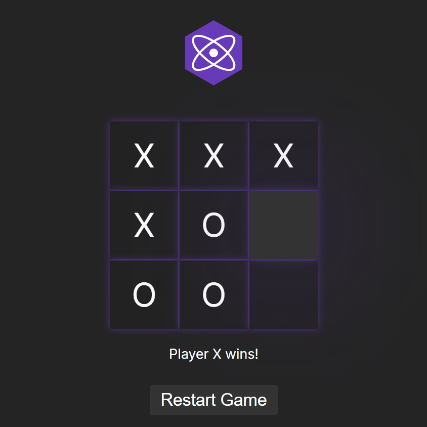
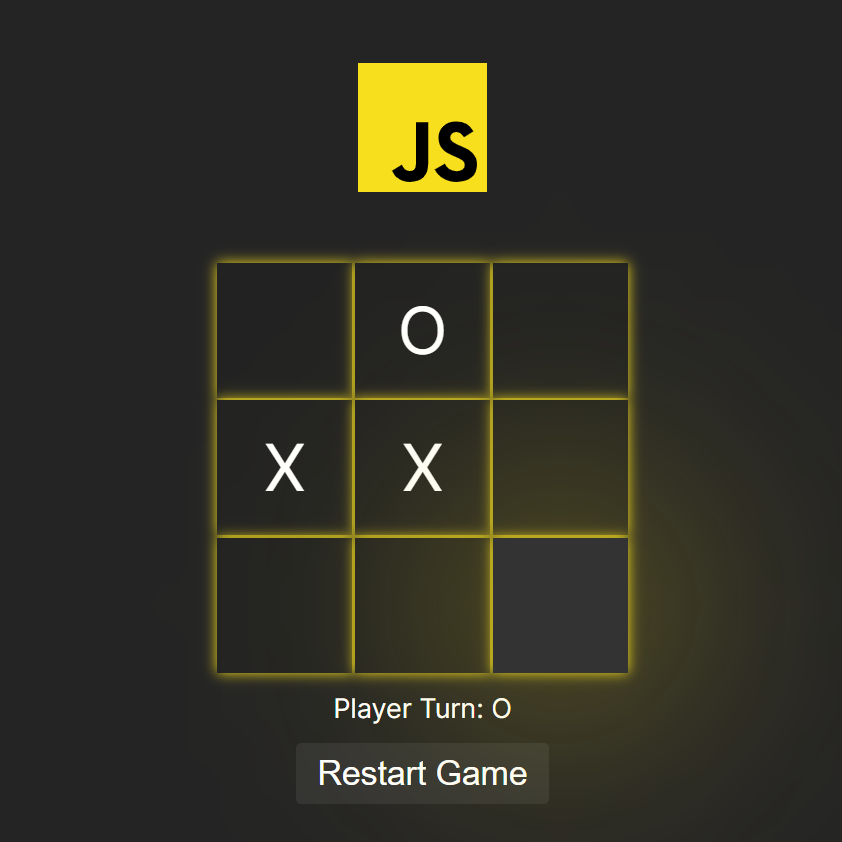
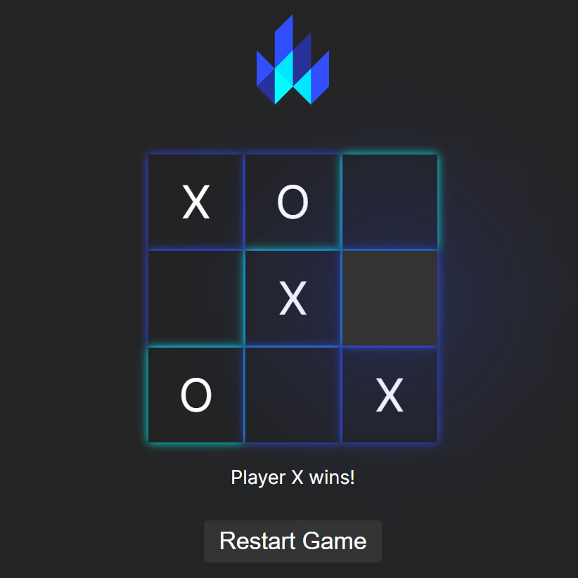
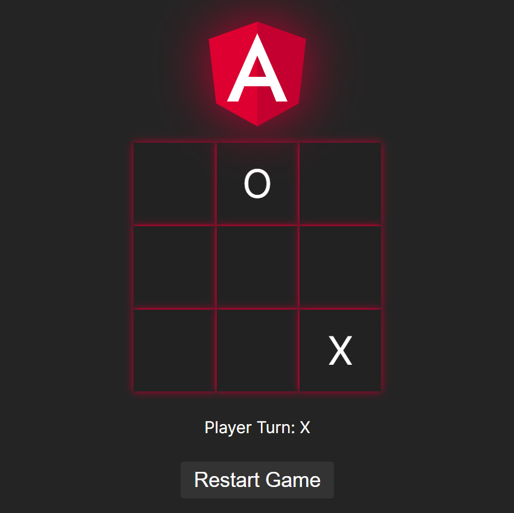
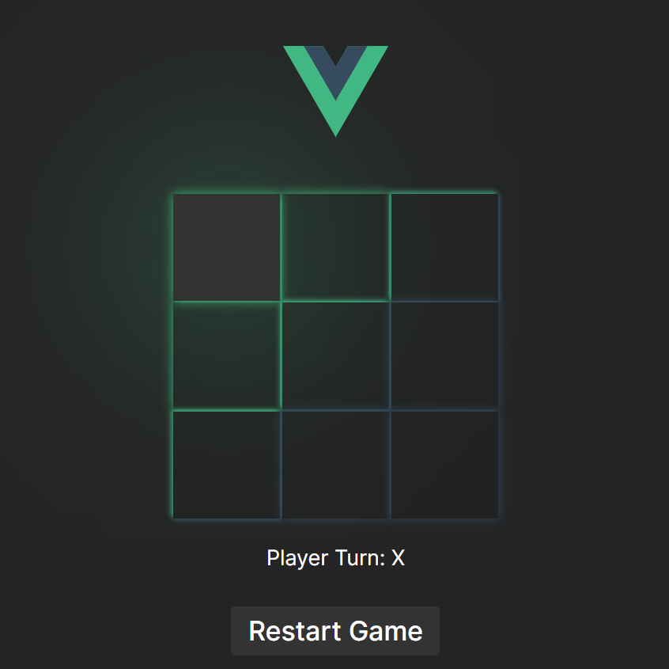
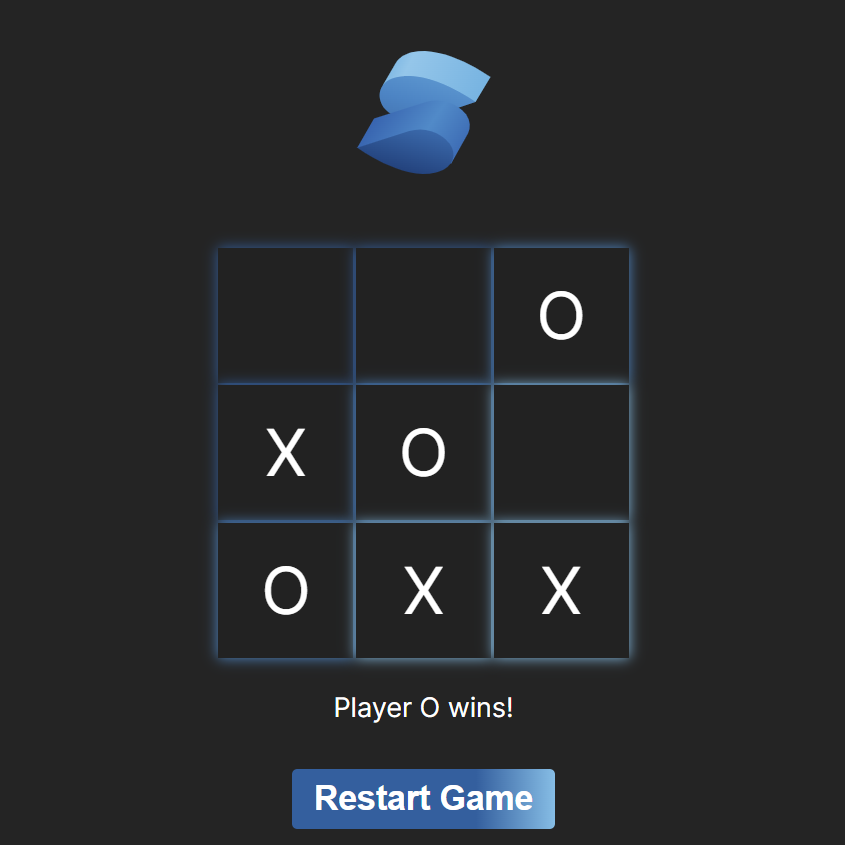
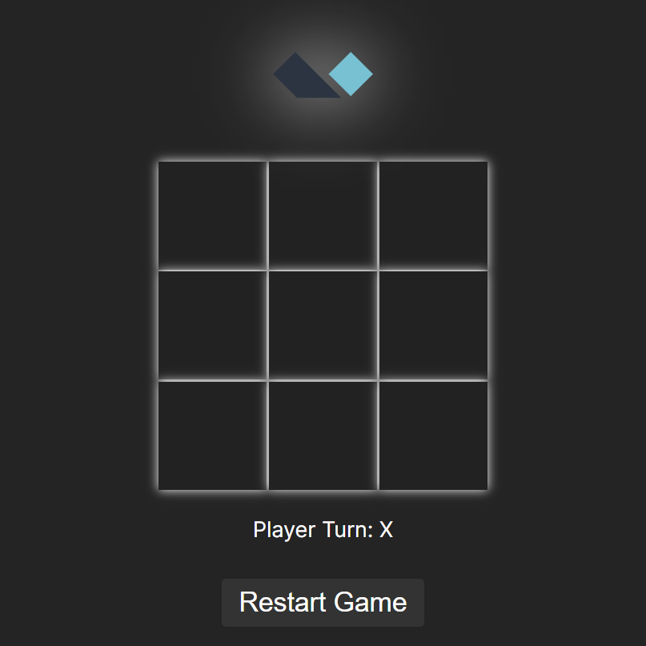

# 🥊 Frontend Frameworks Battle 🥊
## 💻 Project contains the TicTacToe game in 10 different front-end frameworks

<h3>🕸️ Run Online 🕸</h3>

Watch the Demo Below 👇 & Go to 👉 <a href="https://frontend-framework-battle.pranaydesai.com">Link</a> 

<h1></h1>

<h3> Run on Local Machine 🏃  </h3>

`npm install` : to install packages

`npm run start` : to start all projects at once

`npm run start:<frameworkName>` : to start only one project at a time

Ex : `npm run start:react`
<h1></h1>

  
  
  

  
  
  

  
  
  

  

## ⭐ My Ratings ⭐

<h3>I started my journey designing websites with Pure Js and React, So Syntax Similar to them was most easy for me to work with </h3>

| Framework | Easy to Start | Documentation and Tutorials | Interactive Examples | Learning Projects | Overall Rating |
|-----------|---------------|----------------------------|----------------------|-------------------|----------------|
| React     | 5             | 5                          | 4                    | 5                 | 4.4            |
| Alpine    | 5             | 4                          | 3.5                  | 3                 | 3.7            |
| Vue       | 4             | 5                          | 4.5                  | 5                 | 4.3            |
| Angular   | 4             | 4                          | 3.5                  | 5                 | 4.0            |
| Solid     | 5             | 5                          | 3.5                  | 5                 | 3.8            |
| Qwik      | 5             | 5                          | 3                    | 3                 | 4.0            |
| Svelte    | 5             | 5                          | 4                    | 5                 | 4.1            |
| Lit       | 4             | 4                          | 3.5                  | 4                 | 3.8            |
| Preact    | 5             | 5                          | 3.5                  | 5                 | 3.8            |

